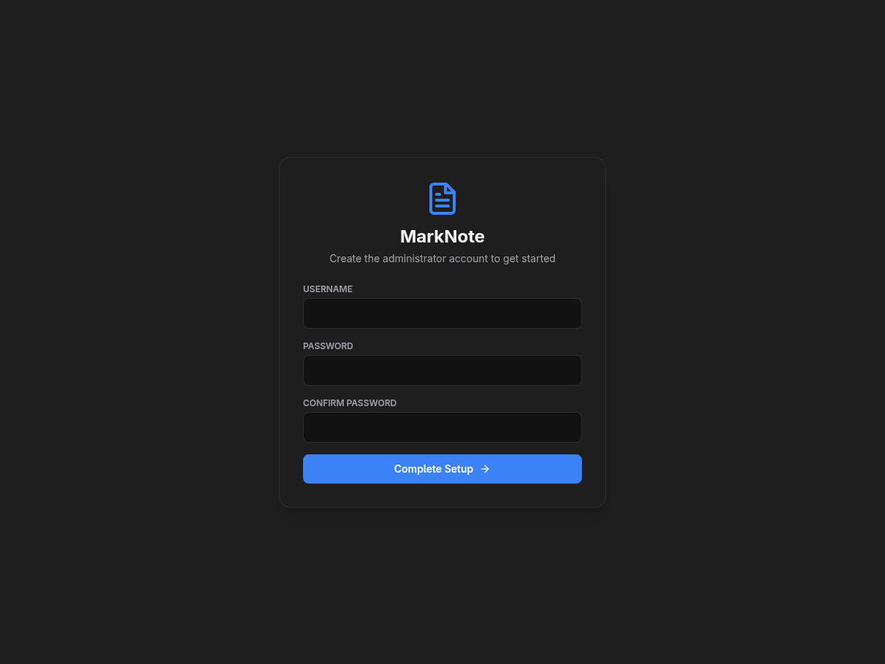
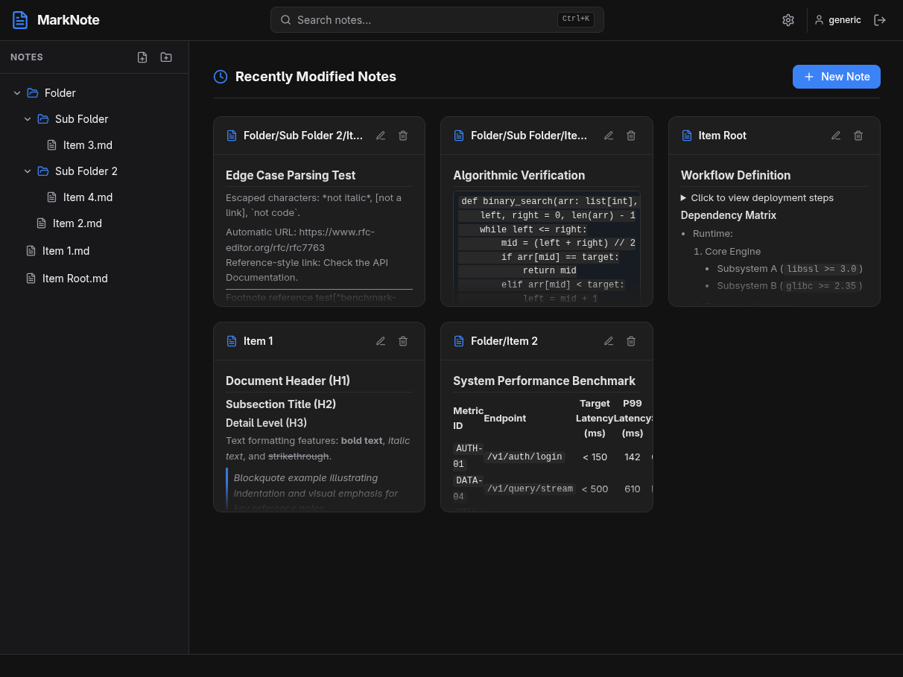
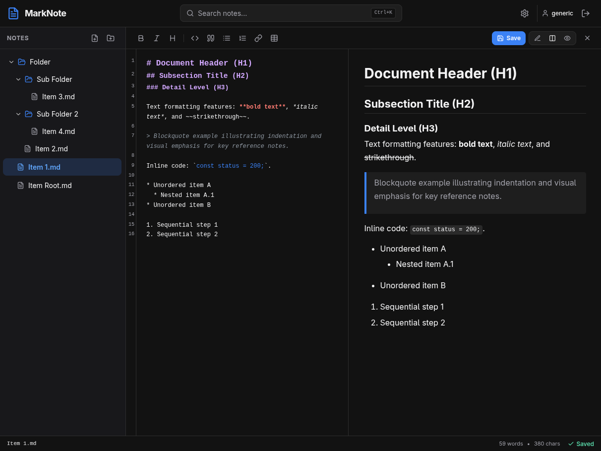
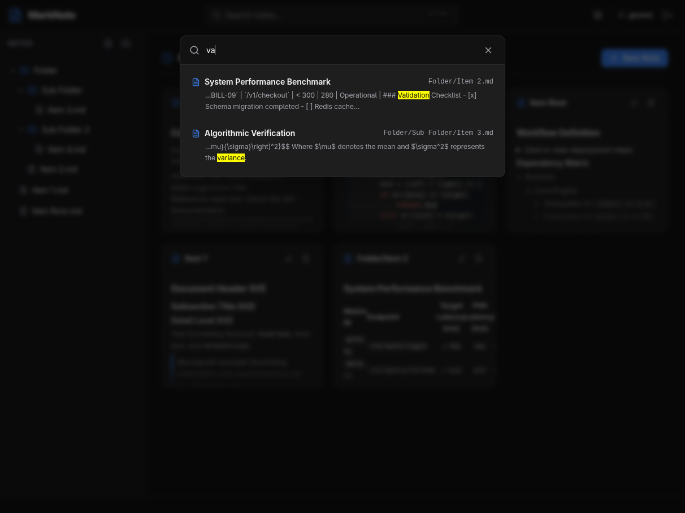
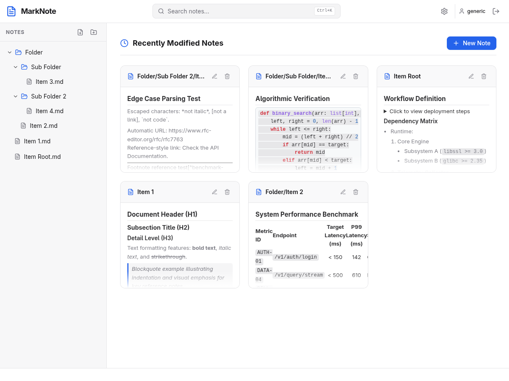
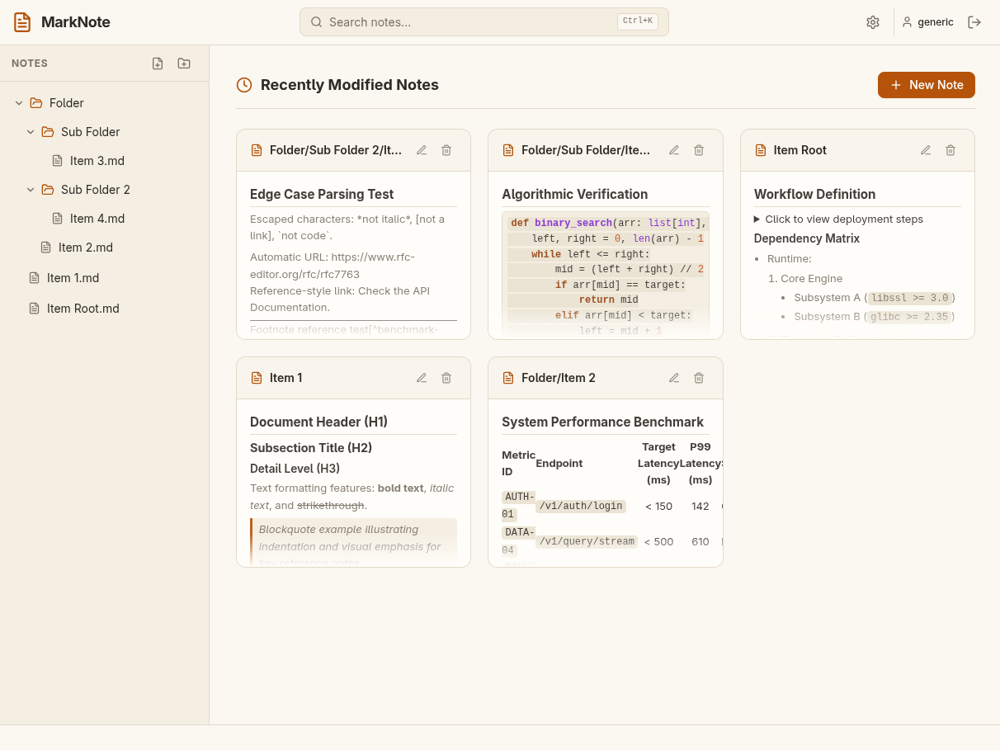
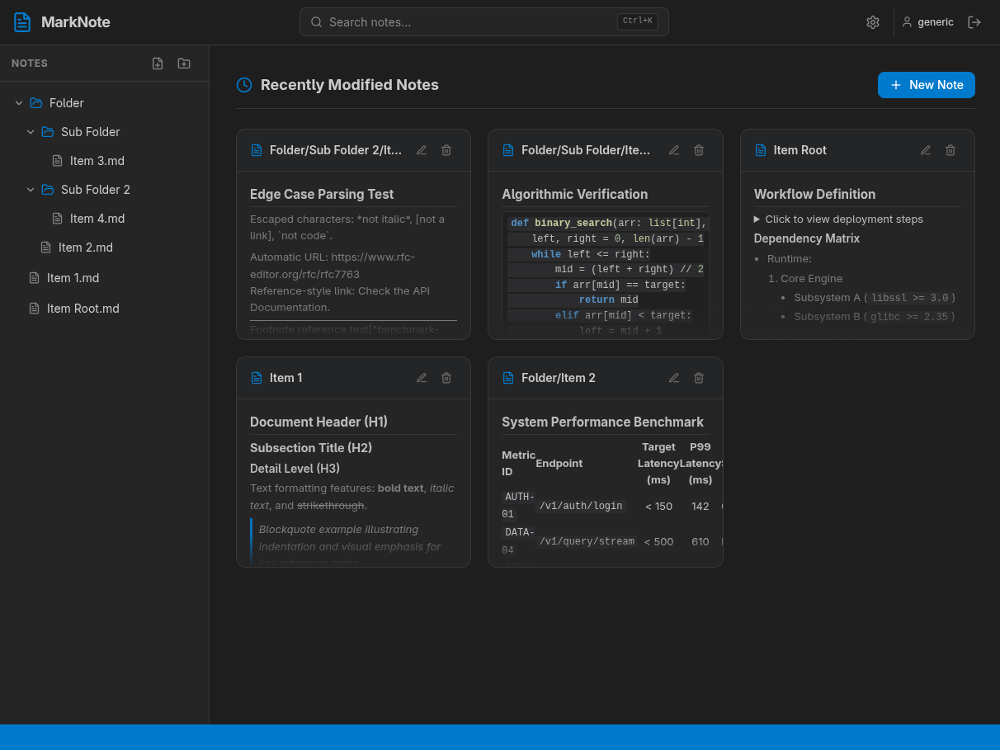
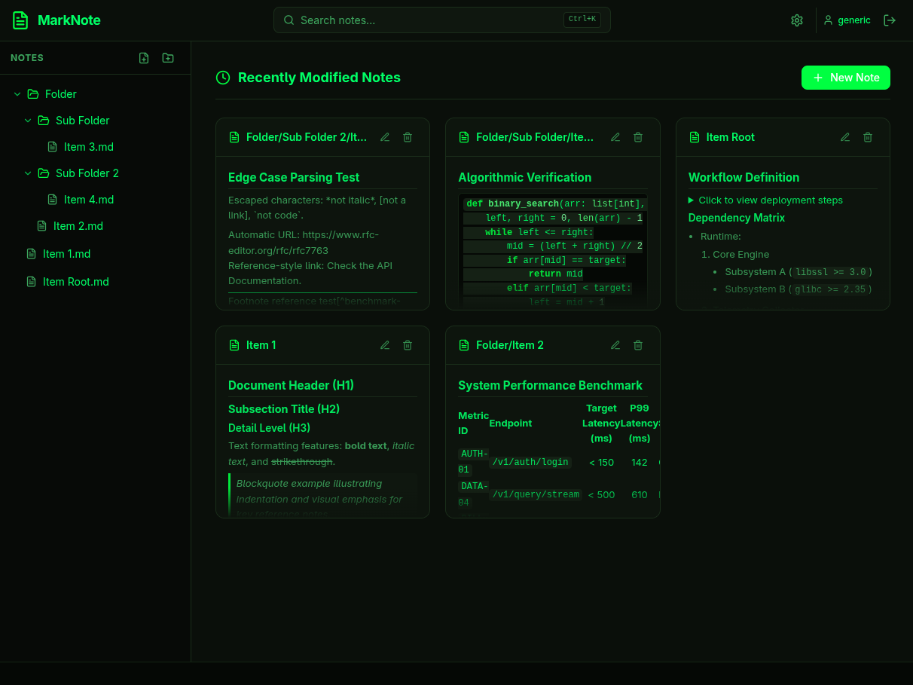

<div align="center">
  
  
  **MarkNote**

  **A self-hosted, privacy-first, lightweight Markdown note-taking.**

  [](https://github.com/odevsa/marknote/releases/latest)
  
  
  
  


  [Features](#features) •
  [Themes](#themes) •
  [Quick Start](#quick-start-with-docker) •
  [Self-hosted](#self-hosted) •
  [Configuration](#configuration) •
  [Development](#development) •
  [Tech Stack](#tech-stack)
</div>


## Overview

<div align="center">
  
  
  <br />
  
  
</div>

**MarkNote** is designed for users who want total control over their notes without being locked into proprietary database formats or cloud services. 

All your notes are stored directly as plain `.md` files in a regular folder on your machine or server. You can edit them with MarkNote, sync them with Syncthing or Git, or open them in any editor (Obsidian, Neovim, VS Code) seamlessly.

## Features

- **Direct Filesystem Persistence**: No vendor lock-in. Notes remain plain `.md` files in standard directory hierarchies.
- **Lightning Fast FTS5 Search**: Instant full-text search across all notes powered by SQLite FTS5 and automatic file-watcher synchronization (`notify`).
- **CodeMirror 6 Markdown Editor**: Rich syntax highlighting, line numbers, shortcuts (`Ctrl+S`, `Ctrl+K`), formatting toolbar, and live side-by-side preview.
- **Smart Auto-Save & Local Draft Recovery**:
  - Configurable auto-save toggle and delay (0.5s to 5.0s).
  - Browser `localStorage` draft protection when auto-save is off, with prompt to restore or discard drafts on open.
- **Deep Linking & Direct Navigation**: Bookmarking or sharing links directly to specific files and modes (`/file/folder/note.md`, `/file/.../edit`, `/file/.../split`).
- **Dynamic Theme System**: Includes Dark, Light, Paper (sepia book theme), Code (VS Code dark), Matrix, and System auto-detect.
- **Internationalization (i18n)**: Built-in support for 5 languages:
  - English (`en`)
  - Português do Brasil (`pt-BR`)
  - Español (`es`)
  - Français (`fr`)
  - Italiano (`it`)
- **Privacy-First & Secure**: Self-hosted, single user/admin setup with Argon2id password hashing and HTTP-only JWT sessions.
- **Single Binary Distribution**: Backend in Rust (Axum) embeds the frontend SPA for lightweight deployment with minimal RAM footprint.

## Themes

MarkNote features dynamic theme support tailored for different writing environments and lighting preferences:

<div align="center">
  
  
  <br /><br />
  
  
</div>

## Quick Start with Docker

The fastest way to get MarkNote running is with Docker Compose:

```bash
# 1. Clone the repository
git clone https://github.com/odevsa/marknote.git
cd marknote

# 2. Start using Docker Compose
docker compose up -d
```

Open your browser at `http://localhost:3980`. On your first access, MarkNote will guide you through setting up your administrator credentials.


## Self-hosted

MarkNote publishes official multi-architecture Docker images (`linux/amd64`, `linux/arm64`) to Docker Hub at [`odevsa/marknote`](https://hub.docker.com/r/odevsa/marknote).

### Umbrel OS

1. Connect to your Umbrel server via SSH or open the custom app editor.
2. Create an app directory: `/home/umbrel/umbrel/app-data/marknote`.
3. Create `docker-compose.yml`:

```yaml
version: '3.7'

services:
  app_proxy:
    environment:
      APP_HOST: marknote_web_1
      APP_PORT: 3000

  web:
    image: odevsa/marknote:latest
    container_name: marknote_web_1
    restart: unless-stopped
    environment:
      - PORT=3000
      - HOST=0.0.0.0
      - DATA_DIR=/app/data/base
      - NOTES_DIR=/app/data/notes
      - JWT_SECRET=change_this_to_a_secure_random_secret_32_chars
    volumes:
      - ${APP_DATA_DIR}/data/base:/app/data/base
      - ${APP_DATA_DIR}/data/notes:/app/data/notes
```

4. Run `umbrelcli app start marknote` or bring up the container using Docker Compose.

### CasaOS

1. Open your **CasaOS Dashboard** and click on **AppStore**.
2. Click **Custom Install** at the top right.
3. Fill in the installation fields:
   - **Docker Image**: `odevsa/marknote:latest`
   - **Title**: `MarkNote`
   - **Web UI Port**: `3980` -> `3000` (or any free host port)
   - **Volume 1**: `/DATA/AppData/marknote/data` -> `/app/data/base`
   - **Volume 2**: `/DATA/AppData/marknote/notes` -> `/app/data/notes`
   - **Environment Variable**: `JWT_SECRET` = `your_random_secret_string_32_chars`
4. Click **Submit** to install and run.

### Docker Compose

1. Create a `docker-compose.yml` file:

```yaml
services:
  marknote:
    image: odevsa/marknote:latest
    container_name: marknote
    restart: unless-stopped
    ports:
      - "3980:3000"
    environment:
      - PORT=3000
      - HOST=0.0.0.0
      - DATA_DIR=/app/data/base
      - NOTES_DIR=/app/data/notes
      - JWT_SECRET=change_this_to_a_secure_random_secret_32_chars
    volumes:
      - marknote_data:/app/data/base
      - marknote_notes:/app/data/notes

volumes:
  marknote_data:
  marknote_notes:
```

2. Start the container:

```bash
docker compose up -d
```


### Docker CLI (Docker Run)

```bash
docker run -d \
  --name marknote \
  -p 3980:3000 \
  -v $(pwd)/data/base:/app/data/base \
  -v $(pwd)/data/notes:/app/data/notes \
  -e JWT_SECRET="change_this_to_a_secure_random_secret_32_chars" \
  --restart unless-stopped \
  odevsa/marknote:latest
```


## Configuration

MarkNote is configured using environment variables:

| Variable | Default | Description |
| :--- | :--- | :--- |
| `PORT` | `3000` | Port on which the HTTP server listens |
| `HOST` | `0.0.0.0` | Host IP address binding |
| `DATA_DIR` | `./data/base` | Directory for SQLite metadata and FTS5 search database |
| `NOTES_DIR` | `./data/notes` | Directory where raw `.md` markdown files are stored |
| `JWT_SECRET` | *(auto-generated)* | Secret key used for signing authentication JWTs |
| `DATABASE_URL` | *(auto-configured)* | SQLite connection URI (`sqlite://./data/base/marknote.db?mode=rwc`) |


## Tech Stack

### Backend
- **Rust** & **Axum**: High-performance, memory-safe asynchronous web server.
- **SQLx** & **SQLite FTS5**: Embedded database for settings and full-text search index.
- **Notify**: Cross-platform filesystem watcher for real-time index synchronization.
- **Argon2** & **jsonwebtoken**: Industry-standard password hashing and authentication.

### Frontend
- **Svelte 5**: Modern reactive UI framework.
- **Tailwind CSS**: Utility-first styling with dynamic CSS design tokens.
- **CodeMirror 6**: Extensible code editor with custom Markdown syntax highlighting.
- **Marked** & **DOMPurify**: Fast Markdown parsing and secure HTML sanitization.


## Development

### Prerequisites
- **Rust** 1.80+ (`rustup default stable`)
- **Node.js** v20+ / v22+ & **npm**

### Running with Hot-Reload (Recommended)

Run both the Rust backend and Vite dev server simultaneously with one command from the project root:

```bash
npm run dev
```

This starts:
- Frontend Vite Server at `http://localhost:5173`
- Backend Axum Server at `http://localhost:3000` (proxied by Vite)

### Building for Production

```bash
# 1. Build Frontend Static Assets
cd frontend
npm install
npm run build

# 2. Compile Rust Single-Binary
cd ../backend
cargo build --release
```

The resulting binary in `backend/target/release/marknote` embeds all frontend assets into a standalone executable.
